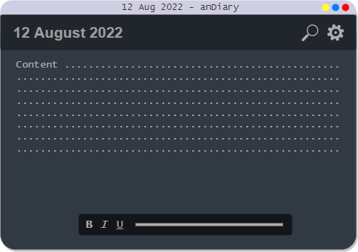

<h1 align="center">&iary</h1>

Your personal daily journal app

## Future Preview

> This project is currently a work in progress. If you have any ideas, join our [Discord][discord] and discuss with us.

## Getting Started

These instructions will get you a copy of the project up and running on your local machine for development and testing purposes. See deployment for notes on how to deploy the project on a live system.

### Installing

You can install the application for your platform from the [downloads page][download]

### Development Setup

Follow the steps in [DEVELOPMENT.md](./.github/DEVELOPMENT.md)

## Built With

- [Docusaurus](https://docusaurus.io/) - Documentation Framework
- [Nextron](https://github.com/saltyshiomix/nextron) - Electron App Boilerplate with nextjs
- [Turborepo](https://turborepo.org/) - Monorepo Management Tool

## Contributing

Please read [CONTRIBUTING.md](./.github/CONTRIBUTING.md) for details on our code of conduct, and the process for submitting pull requests to us.

## Versioning

We use [SemVer](http://semver.org/) for versioning. For the available versions, see the [tags on this repository][tags].

## License

This project is licensed under the MIT License - see the [LICENSE.md](LICENSE.md) file for details

## Links

- [Project Homepage][homepage]
- [Help Center][docs]
- [Public Repository][repo]
- [Issue Tracker][issues]
  - In case of sensitive bugs like security vulnerabilities, please contact Naffy Dharni#5103 directly on Discord instead of using the issue tracker. We value your effort to improve the security and privacy of this project.
- Related projects:
  - [Diary Classic][classic-diary]
  - [Mini Diary](https://github.com/samuelmeuli/mini-diary)

<!-- * Hat tip to anyone whose code was used
## Acknowledgments

- Inspiration - [Mini Diary](https://github.com/samuelmeuli/mini-diary)
- Guides: - [Stackoverflow](https://stackoverflow.com)
* etc -->

[homepage]: https://anDiary.tk
[download]: https://anDiary.tk/download
[issues]: https://github.com/anDiary/anDiary/issues
[tags]: https://github.com/anDiary/anDiary/tags
[andiary]: https://github.com/anDiary
[classic-diary]: https://github.com/naffydharni006/Diary
[docs]: https://help.anDiary.tk
[contributors]: https://github.com/anDiary/anDiary/contributors
[repo]: https://github.com/anDiary/anDiary
[discord]: https://discord.gg/BU4kQbBqAe
